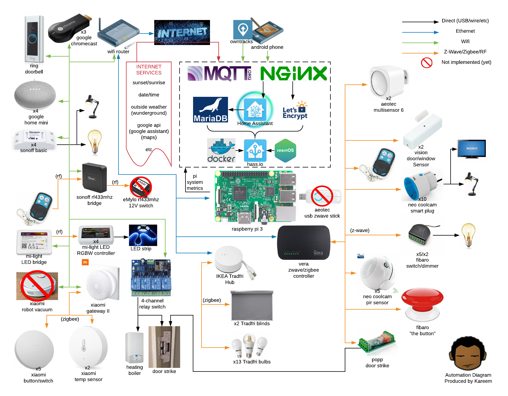

# Kareems home-assistant-config

## Introduction

This is the project of my Home Automation journey.

## Why I did this

I wanted to automate my living space for some time, but I never had the chance or the right property.
When I decided to purchase a house, I decided that this was the perfect time.

Also, because I like automating things.

## My automation policy

A few things I try to keep my system in-line with, which helps me make decisions about what hardware to purchase etc.
I'll try to explain a few of those decisions here.

### Centralised automation first

My goal is to have a single interface for everything, and have all sub-systems managed through this single interface of truth.
I did a lot of research on the compatibility and capability of nearly all the systems out there, and I came to the conclusion that I would have to bespoke some of this relative to my needs, but also try to keep it as general as possible.

The home automation space is relatively new, and as such there is much incompatibility between this system and that system, meaning buying Hue bulbs and Ikea bulbs wont work together... And will need separate interfaces.

I experimented with a few centralised systems and eventually came down to a choice between OpenHab and Home-Assistant.
Home-Assistant won out in the end, and I haven't looked back.

### Automation that runs itself

I also wanted to have as much as the automation run itself as possible.
This meant thinking carefully about what I wanted to achieve and what my own lifestyle and workflow is, so that I could translate that into tasks and actions for my system to use.

I found that the key to this is understanding the triggers and actions throughout my life that I normally don't think about.

### Local cloud first

My system, my data.

When I set out on this journey, I knew I wanted very much to have a private system, where I would be in control.
This would of course mean that a lot of systems and processes would need to be setup, like secure remote access, among other problems.

All "core" services and hardware need to work offline, without cloud services requiring them to work.
In the automation space, this can be a real issue, as most suppliers of hardware (Eg: Hubs) and software are tied closely to outside services in the cloud, and will not function when these services become unavailable. This is unacceptable for me, for core automated systems.

This meant the pick of my core systems would need to operate under direct control and function without an internet connection.

### Keep costs low

I wanted to keep costs low and use as much commodity hardware as possible.
This would be so that once I'd found a good solution, I could scale this out easily.

### Pass the "wife test"

It's very important that when an automated system inevitably fails, that my house will still work like you would expect a normal house to work.
This is often been referred to online as the "wife test", to represent a suffering spouse, who will be understandably frustrated because the light switch does not turn on the light as expected (Probably because some gizmo has crashed). To People who are not as enthusiastic about home automation, this can be a major inconvenience to things we take for granted.

As such, all switches and hardware needs to have hardware switches (Lights need to be operable from the regular switch etc), and operate as normally as possible in the absence of the core system itself.

## Components and Hardware

TBC

## Diagram

I produced a diagram to keep track of, and help explain my system to others.

## Automation goals and projects

When enbarking on this, I made sure to make clear a set of taks that I wanted to perform (Or have automated for me).

- [x] notifications & alarms
  - The system to notify me of environmental changes
  - The system should notify me of intruders
    - I should be able to understand locations of the intruders
- [x] lights by motion
  - I should be able to walk through the house without activating lights myself
  - The lights should switch themselves off
- [x] heating & presence
  - The house should be warm when I am home
  - The house should automatically adjust the heating down when I'm away (Or nobody is home)
  - Heating should adjust down when its night time
  - If a designated girlfriend is in the house, the heating should auto-adjust itself 1 or 2 degrees higher
    - And return to "normal" when I am alone
- [x] secure keyless entry
  - I should be able to buzz my door when without using a key
  - I should be able to see who is at the door
- [x] voice control
  - I want to be able to control, using my voice:
    - lights
    - automations
- [ ] plant watering
  - The plants should be watered automatically
    - based on schedule or moisture level
- [ ] vacuum robot
  - A robot shpuld vacuum the house when I'm not home
  - The robot should return when I'm home or returning home
